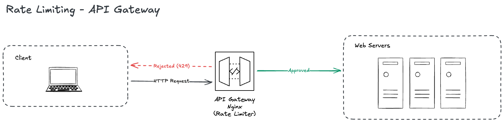

# Rate Limiting - API Gateway

## Request Flow

1. A client sends an HTTP request to the system.
2. The request first reaches the **API Gateway** (e.g., Nginx), which acts as the entry point.
3. The API Gateway applies rate limiting logic:
   - If the request is within the allowed limit, it is forwarded to the backend web servers.
   - If the request exceeds the allowed limit, the API Gateway responds directly with HTTP 429 Too Many Requests.
4. Rejected requests **never reach the backend servers**, protecting them from overload.

## References

[Amazon API Gateway - Throttle requests to your REST APIs for better throughput in API Gateway](https://docs.aws.amazon.com/apigateway/latest/developerguide/api-gateway-request-throttling.html)

[Azure - API Management - Advanced request throttling](https://learn.microsoft.com/en-us/azure/api-management/api-management-sample-flexible-throttling)

[Google Cloud - API Gateway - Quotas and limits](https://docs.cloud.google.com/api-gateway/docs/quotas)

[Rate Limiting with NGINX](https://blog.nginx.org/blog/rate-limiting-nginx)

[NGINX Limit Request Module](https://nginx.org/en/docs/http/ngx_http_limit_req_module.html)

[Deploying NGINX as an API Gateway, Part 2: Protecting Backend Services](https://www.f5.com/company/blog/nginx/deploying-nginx-plus-as-an-api-gateway-part-2-protecting-backend-services)

[mod_ratelimit - Apache HTTP Server Version 2.4](https://httpd.apache.org/docs/2.4/mod/mod_ratelimit.html)

[API Rate Limiting: Beginner's Guide](https://konghq.com/blog/learning-center/what-is-api-rate-limiting)
