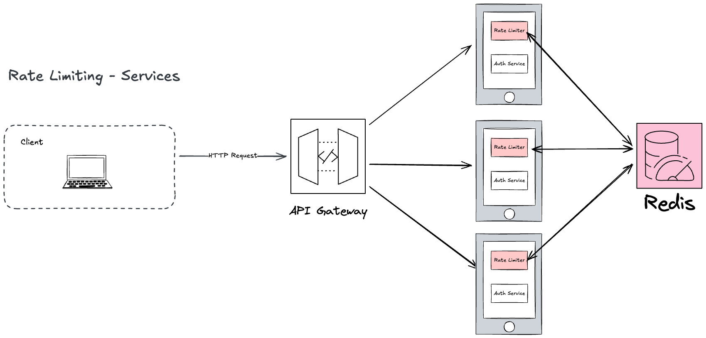

# Rate Limiting - Individual Services

## Request Flow

1. A client sends an HTTP request to the system.
2. The request reaches the **API Gateway**, which acts as a routing entry point (no rate limiting here).
3. The API Gateway forwards the request to the appropriate backend service.
4. **Each service enforces its own rate limiting** independently:
   - The service checks the request against its rate limit policy using a shared counter store (e.g., Redis).
   - If the request is within the allowed limit, the service processes it.
   - If the request exceeds the allowed limit, the service responds with HTTP 429 Too Many Requests.
5. Each service can have **different rate limit thresholds** based on its specific needs (e.g., 100 req/min for Auth Service, 10 req/min for Payment Service).

## Key Differences from API Gateway Rate Limiting

- **Rate limiting happens inside each service**, not at the gateway layer
- **Each service can have custom limits** based on business logic
- **Requires shared state management** (Redis) to coordinate limits across multiple service instances
- **More engineering overhead** to implement and maintain across multiple services

## Trade-offs

**Advantages:**
- Services can implement business-logic-aware rate limits
- Resilient: one service's rate limiter failure doesn't affect others

**Disadvantages:**
- Complex to implement across multiple services
- Requires coordinating state via Redis or similar
- More difficult to monitor and debug

## References

[Coordinated Rate Limiting in Microservices](https://engineering.salesforce.com/coordinated-rate-limiting-in-microservices-bb8861126beb/)

[Grab - How We Designed the Quotas Microservice to Prevent Resource Abuse](https://engineering.grab.com/quotas-service)

[DreamFactory - How Distributed Rate Limiting Works with Open-Source Tools](https://blog.dreamfactory.com/how-distributed-rate-limiting-works-with-open-source-tools)
