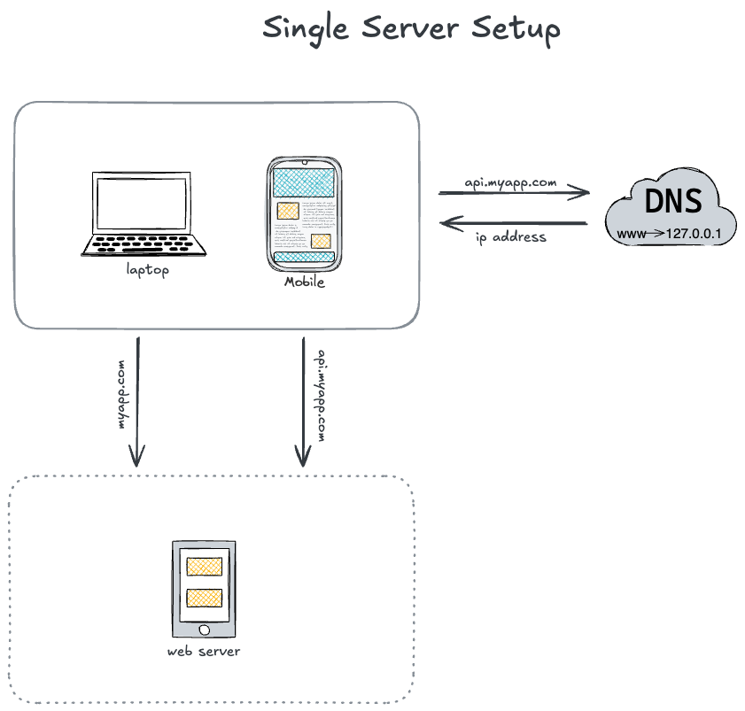

# Single Server Setup

## Request Flow

1. A user starts by sending a request from their client (e.g., web browser or mobile app).
2. The domain name system (DNS) resolves the server's domain name to its IP address.
3. An HTTP request is sent to the server.
4. The web server processes the request and returns the appropriate response (e.g., HTML, CSS, JavaScript, images, JSON, etc).

### References

- [DNS Explained](https://www.cloudflare.com/learning/dns/what-is-dns/)
- [What is a web server?](https://developer.mozilla.org/en-US/docs/Learn_web_development/Howto/Web_mechanics/What_is_a_web_server)
- [HTTP Overview](https://developer.mozilla.org/en-US/docs/Web/HTTP/Overview)
- [Client-Server Model](https://developer.mozilla.org/en-US/docs/Learn/Server-side/First_steps/Client-Server_overview)
- [How the Web Works](https://developer.mozilla.org/en-US/docs/Learn/Getting_started_with_the_web/How_the_Web_works)
- [HTML Basics](https://developer.mozilla.org/en-US/docs/Learn/Getting_started_with_the_web/HTML_basics)
- [CSS Basics](https://developer.mozilla.org/en-US/docs/Learn/Getting_started_with_the_web/CSS_basics)
- [JavaScript Basics](https://developer.mozilla.org/en-US/docs/Learn/Getting_started_with_the_web/JavaScript_basics)
- [JSON Introduction](https://www.json.org/json-en.html)
